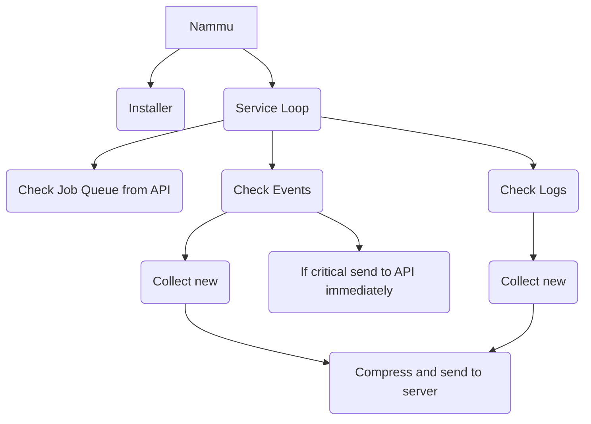

# Nammu - RMM Agent

## Program Flow

## TODOs

- import config from file
- config dictates where to download further config from (just write in this, we dont know what furhter config stuff we want yet!)

- Windows service detection
- Checking over what logs/events that tacticalRMM tracks.
- Tracking update status
- Deploying powershell scripts

## Jobs

Create NATs channel per-organization: `nammu-{orgid}-jobs`

We then dictate jobs, specifying the agentId in the json objrct sent in the channel.

## Identifying Servers

Identifying servers themselves is tricky, on intial design, i wrote servers with server Ids. This was a fairly simple oversight based om the intial structure i was creating.

We should adjust the model(s) to be agent based. This means the agent is assigned an ID, and this is then used to refer to both the server and agent, as from an operation POV, they are one and the same.

## Communication

Communication between the Server and the agent's is done via a pub/sub protocol, NATS performed over websockets (port 443)

Data transmitted via JSON.

The agents will send periodic heartbeats to the server, with minimal data. This heartbeat will confirm server status, and if there are any pending jobs,
will set them off to run.

Upon job completion/end, the agent will inform the server of the result of the task, and send relevant data back.

### Event Log

Events are sent to server from agents, published via the `nammu-eventlog` channel.
This is done hourly, and can also be requested with specific queries via the UI panel(s) (TODO)
